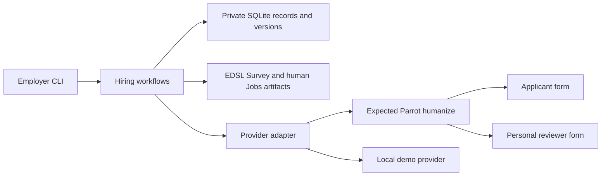

# Architecture

Spence is an independent package alongside McCall. The only shared runtime dependency is EDSL from GitHub `main`. A McCall post export is an optional import format; Spence needs no McCall installation.

## Modules

| Module | Responsibility |
| --- | --- |
| `cli.py` | JSON command output, input/import handling, explicit send/export/recovery actions |
| `service.py` | Openings, publications, application revisions, assignments, decisions, lifecycle operations |
| `store.py` | SQLite transactions, version history, relationship constraints, source deduplication, events, backups |
| `forms.py` | EDSL presets/imports, humanize schemas, human-only Jobs, answer validation, selected packets |
| `provider.py` | Narrow Coop integration, response envelopes, deterministic local demo behavior |
| `report.py` | Private escaped HTML candidate reports; no model calls |
| `util.py` | Input checks, IDs, hashes, atomic owner-only file writes |

## Storage

`spence.json` identifies the workspace, provider, operator, and source-account label. Operational data lives in `.spence-private/ats.sqlite3`; Jobs artifacts live in `.spence-private/artifacts/`. The demo stores its simulated remote state separately in `.spence-private/demo-provider.json`.

The database uses versioned JSON records with indexed relational envelopes. `records` holds the current revision; `versions` preserves earlier revisions; `refs` enforces entity relationships; `source_versions` binds provider response revisions to normalized objects; `events` records operator actions. Multi-record workflow changes use SQLite transactions and optimistic revision checks. Candidate/application/review import failures roll back before a separate quarantine record is saved. This is an alpha schema, with whole-record scans acceptable for a small team; opening/stage indexes and pagination belong in the next scaling pass.

Design records and publications contain immutable snapshots. Application responses create separate candidate and application identities without treating email as proof of identity. Each submission revision is separate. Each review batch points to one candidate submission version and a frozen rubric/roster, so later edits cannot silently alter an earlier assessment.

## Remote effects

Publishing and sending use durable operation records created before the provider call. A confirmed provider identity is persisted before subsequent configuration. Unknown outcomes block retries and require reconciliation or an explicit operator record of verified remote absence. Provider publication and local transactions cannot be one atomic transaction; this is why recovery is a first-class workflow.

Publication states are `prepared`, `configuring`, `open`, and `closed`. The related operation carries `pending`, `confirmed`, `outcome_unknown`, or `confirmed_not_created`. Openings separately record `draft`, `open`, `closing`, or `closed`. Assignment completion and invitation delivery have separate fields. Revocation/deletion states describe pending work honestly.

## Current boundaries

Human-only Jobs contain no models. Reviewer AgentLists identify people, not synthetic respondents. Candidate packets contain selected application answers and public job context; they exclude internal notes and other reviews. Hosted rendering/authentication belong to Expected Parrot and still require acceptance testing. The local filesystem is the employer authorization boundary; Spence is not a shared server with per-user roles.
