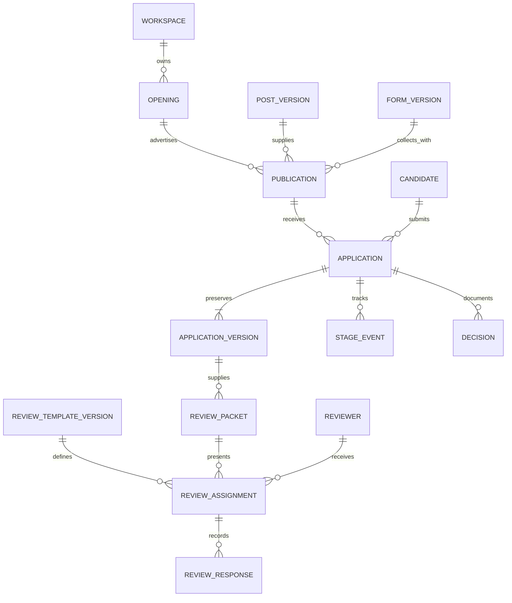

# Spence applicant tracking specification

Product specification 0.1 · September 10, 2026. A CLI alpha is now implemented; see the [README](../README.md) for its actual commands and the [provider release gates](provider-contracts.md) for unfinished hosted capabilities. This document retains the broader target scope and illustrative commands.

Spence should support the complete loop from a job advertisement to an application, structured human feedback, and a recorded hiring decision. An employer designs the application as an EDSL Jobs artifact, publishes it through `ep humanize`, and adds the resulting Apply link to a post. Spence imports submissions, organizes candidates by opening and stage, and sends candidate-specific review surveys to selected people. Spence is a companion to McCall, which remains focused on synthetic job-post studies. Spence accepts ordinary job posts independently and can import versioned posts and role briefs from McCall with their provenance.

This draft assumes one hiring team operates a private Spence workspace through the CLI; applicants and reviewers use hosted Expected Parrot forms. The first release includes resumes, application stages, and structured reviews. Calendar scheduling, a shared employer web application, and multiple organizations on one Spence service are later work. These are proposed defaults, pending user feedback.

**1. Product boundaries and first-release scope**

The employer should be able to:

- Create a hiring opening, associate one or more post variants, and specify the hiring team and review stages.
- Import or construct a reusable application form, preview it, publish it as a humanize job, and export a post containing an Apply link.
- See completed applications, search/filter them, view resumes and answers, record notes, and move applications through stages.
- Select reviewers, define a rubric or open-ended feedback survey, send personal invitations, and track delivery and completion separately.
- Compare attributed feedback and record an explicit human decision with a reason.
- Close intake, withdraw an application, revoke review access, and remove personal data under an explicit retention policy.

Applicants should be able to read the exact post associated with their application, complete a mobile-accessible form, upload requested documents, and receive an unambiguous completion receipt. Reviewers should be able to open their personal link, view the permitted candidate packet, and submit an independent assessment without installing Spence or EDSL.

EDSL owns form rendering, human response collection, and supported invitation delivery. Spence owns the hiring domain: openings, application identity, stages, review assignments, packet versions, decisions, permissions, synchronization, and operational history. The first release does not build another survey renderer. It does not automatically reject applicants, rank them using synthetic responses, or send their materials to a model. Any future AI assistance must be an explicit, separately attributed operation.

**2. What EDSL currently provides**

The integration was inspected on GitHub `main` at commit `476cedd7ac958d042118b959490a332faa12cab1`. This confirms client APIs, not the complete behavior of the hosted service.

| Capability | Verified client surface | Design consequence |
| --- | --- | --- |
| Publish Jobs as human forms | `ep humanize create --jobs ... --schema ...`; Jobs containing models are rejected; scenarios require an assignment method | Build human-only application/review Jobs; use one scenario with `single_scenario` |
| Form presentation and validation | Humanize schemas, local schema validation, hosted preview | Store the Survey and humanize schema as one versioned application definition |
| File questions | A `file_upload` humanize schema exists | Resume collection can use EDSL, subject to end-to-end upload/access verification |
| Named reviewers | Agent lists, delivery maps, personal respondent links, and respondent status | Use agent lists as recipient rosters, not simulated candidate personas |
| Delivery | Email routes, delivery jobs, task statuses, schedules, and callbacks | Keep invitation delivery state separate from review state |
| Responses | `get_human_survey_responses()` returns completed responses as Results, with a ScenarioList fallback | Build a dedicated human-response adapter; do not route through simulation ingestion |
| Polling windows | The client exposes `started_after`/`started_before`, defined by survey-open time | Do not use those fields as a last-submission cursor; a late completion could otherwise be missed |

These surfaces are defined in the pinned [humanize CLI](https://github.com/expectedparrot/edsl/blob/476cedd7ac958d042118b959490a332faa12cab1/edsl/cli_commands/humanize.py), [Coop client](https://github.com/expectedparrot/edsl/blob/476cedd7ac958d042118b959490a332faa12cab1/edsl/coop/coop.py), [humanize schemas](https://github.com/expectedparrot/edsl/blob/476cedd7ac958d042118b959490a332faa12cab1/edsl/coop/coop_humanize_schema.py), and [notification schemas](https://github.com/expectedparrot/edsl/blob/476cedd7ac958d042118b959490a332faa12cab1/edsl/coop/coop_humanize_notifications.py).

The notification schema lists email routes. Its callbacks must not be assumed to provide arbitrary authenticated HTTP webhooks. The callback event types in the schema are also broader than one client method's docstring describes; verify actual server support before relying on a specific event.

**3. Employer, applicant, and reviewer journeys**

An employer opens “Backend Engineer — Fall hiring,” imports the role brief and two advertisements, and optionally uses McCall to run a synthetic diagnostic before importing the chosen post. The employer then designs an application containing contact details, a resume, relevant experience, and role-specific questions. Publication freezes the form, public post, and presentation settings. Spence returns an Apply URL and can export a new Markdown/HTML rendition of the post containing that URL. It does not overwrite the post snapshot used by an earlier study or edit a third-party job board automatically.

An applicant follows the link in post A. Their submission is attributed to that opening, post A's publication, and the specific form version through the provider binding. These IDs are not trusted merely because they appear in browser-editable query parameters or answers. The applicant receives a completion screen; an email acknowledgment is a separate delivery whose failure does not invalidate the application. Spence shows the application after the next synchronization and displays when it last checked for new submissions.

The employer selects that application and asks a hiring manager and a technical reviewer for feedback. Spence prepares a packet from an explicit application version and a review rubric. Each reviewer receives an individual link. Reviewers see the approved candidate material and role criteria, but not other candidates, internal notes, or prior reviewers' opinions by default. Their responses appear as attributed assessments in Spence. A hiring manager records the next stage or final decision.

**4. Domain model**

An opening is the hiring process; a post is an advertisement for it. A candidate is a person; an application is that person's submission to one opening. Keeping these separate supports multiple advertisements and the same person applying to several openings without mixing their evidence or status.



| Record | Essential fields and invariants |
| --- | --- |
| Workspace | Stable ID, owner, private data location, configured provider account; one authoritative writer in v1 |
| Opening | ID, title, role version, owner, lifecycle state, stage definitions, timestamps |
| Post version | Spence post ID/hash plus optional McCall source ID/version; content never changes in place |
| Form version | Survey, humanize schema, typed field mappings, branching rules, document requirements, notice text, artifact hashes, EDSL commit |
| Publication | Opening/post/form versions, provider survey UUID, public Apply URL, revision hash, desired and confirmed intake state |
| Candidate | Internal ID, contact values, verification state, duplicate/merge history; email alone is not a trustworthy identity key |
| Application | ID, candidate/opening/publication IDs, provider response identity, current version and stage, submission time, sync time |
| Application version | Immutable submitted answers, attachment references, provider revision/hash, source artifact reference |
| Attachment | Storage/provider ID, original filename, content type, size, digest, access state, screening state; no permanent public download URL |
| Reviewer | Internal ID, name/contact, relationship or role, access policy; distinct from an EDSL synthetic persona |
| Review packet | Explicit application version, allowed fields/documents, role criteria, redaction policy, packet hash |
| Review assignment | Application version, packet/template versions, reviewer, round, provider/respondent IDs, due date, completion and delivery states |
| Review response | Source response identity, assignment, answers, rubric version, submission/revision time; attributable human evidence |
| Stage event / decision | Actor, application, previous/new state, reason, timestamp, referenced evidence; changes are explicit |
| Sync / delivery operation | Operation ID, idempotency key, attempt state, provider references, last error; supports uncertain remote outcomes |

A uniqueness constraint on `(provider_account, human_survey_uuid, response_uuid, provider_revision)` prevents repeated downloads from duplicating submissions. A response UUID is scoped to its source. Content hashes detect revisions; they are not respondent identities. If the provider does not supply revisions, a new payload hash creates a source revision for the same response.

**5. Designing and publishing an application**

The application definition consists of:

1. An EDSL Survey with stable question names and branching rules.
2. A humanize schema for required/optional fields and presentation.
3. Spence field mappings, such as `candidate_email -> contact.email`, `candidate_name -> contact.name`, and `resume -> attachments.resume`.
4. An explicit public scenario containing the opening label, exact public post, and opaque publication context. It contains no private role brief, applicant records, or simulation personas.
5. Publication settings, notice/receipt copy, and a version manifest.

Provide a short application preset and a template import path. Employer-defined questions remain available through ordinary EDSL authoring; Spence should not force users into a second form language. Validate required field mappings, supported human question types, branch-dependent requiredness, and attachment requirements before publication. An unanswered question skipped by a valid branch is not an invalid application. Arbitrary compute or model-powered interview questions are outside the default ATS form allowlist.

Application Jobs have no models and no respondent roster: applicants are not known ahead of time. Use a single public scenario per publication. Separate post variants receive separate provider publications in v1, even when their forms are identical. That makes source attribution reliable without browser-supplied identifiers or scenario randomization.

`publish` is an explicit remote mutation. `build` is local; `preview` clearly identifies whether it uploads a hosted preview. Prefer the EDSL Python APIs behind an adapter, with exportable Jobs and equivalent `ep` commands for inspection. Publication records are never rewritten to point to a different form. After a form change, create a new version and publication; existing sessions and submissions retain their original version. Stable branded routing can be added later with a hosted routing service. The initial Apply URL is stable for its particular publication, not an alias that silently switches forms.

**6. Receiving and managing applications**

Synchronization must normalize both human Results and ScenarioList responses into a provider-neutral submission envelope. EDSL currently reconstructs human Results using a test model; this does not make the evidence synthetic. Set `evidence_kind=human_application` from the authenticated publication/import context, not from the Results model name. Reviews use `evidence_kind=human_review`. Spence does not reuse McCall's simulation `results ingest` path.

Persist the source envelope and application update in one local transaction. Validate the provider survey binding, response identity, form version, mapped fields, required answers, and attachment references. Unexpected sources or records without adequate identity go to a visible quarantine queue. Quarantine is inspectable and retryable; it never silently becomes an application. Support a reviewed manual import when the source cannot establish the expected identity.

Repeated syncs must be idempotent. Poll completed responses with full reconciliation initially; do not advance a cursor based on when respondents started. A future incremental API needs a verified completion/update cursor and a recovery scan. Preserve completion timestamps separately from download time. Display absent timestamps as unknown.

Do not merge applicants automatically because emails or names match. Flag likely duplicates for an operator. A browser retry of the same provider response produces one application; two separate responses with the same email remain distinct until reconciled. Corrections create application versions and mark reviews of earlier packets as referring to earlier evidence. They never rewrite what an existing reviewer saw.

Default stages: `submitted -> screening -> review -> interview -> offer -> hired`, with `rejected` and `withdrawn` available as terminal outcomes. Stages are operator-controlled; a completed review does not itself reject, advance, or hire a candidate. Record skipped stages, reopened applications, and correction reasons as events. Interview is a tracking stage in v1; it does not imply calendar integration.

**7. Requesting opinions on a candidate**

A review template can be a short open-ended survey or a structured rubric. The initial rubric should ask for relationship to the candidate, relevant strengths, concerns, evidence, uncertainty or “insufficient information,” and a recommended next step. Numeric dimensions require explicit anchors. Comparisons group responses by rubric version and show missing reviews and disagreement. They do not silently average incompatible scales into a candidate score.

For each application version, round, rubric, and packet-access policy, build one humanize Jobs artifact with exactly one candidate scenario and a roster of authorized reviewers. Assign with `single_scenario`. Do not create a Jobs Cartesian product of all candidates and all reviewers: that would make candidate isolation dependent on unverified assignment behavior.

Map reviewer agents to provider respondent UUIDs using the provider's strict link export/join, then persist the assignment mapping. Response attribution requires the matching provider publication/respondent relationship. A free-text reviewer name is not sufficient. Personal links are bearer credentials in the current client; they are not proof that the intended person opened the link. Strong reviewer authentication is a capability to verify or add before claiming verified reviewer identity.

Freeze each roster batch after publication. Adding a reviewer can create another one-candidate publication without resending to existing reviewers. Optimization to reuse or mutate rosters comes after the correctness contract is tested.

The employer can prepare invitations, export links for manual delivery, or explicitly send them through the provider. `review send` itself authorizes sending the selected invitations; it should show concrete recipients and content through an inspect/preview operation beforehand, without imposing a second generic confirmation step. A provider delivery task tracks `pending/sent/delivered/bounced/failed` independently of `not_started/in_progress/submitted/expired/revoked` review state. Reminders are explicit by default; scheduled reminders are an opt-in setting with a stop condition.

Submitted reviews are independently sealed from other reviewers until the configured reveal point. A correction is a new review revision. Revocation must disable access to the hosted response route and attached candidate material, not merely hide an assignment in the CLI. If the provider cannot enforce that, a Spence authenticated access service or provider enhancement is required before confidential reviewer access can launch.

**8. Private data, storage, and access**

Spence owns a transactional SQLite ATS database and private artifact store in a configurable private directory, such as `.spence-private/`. Initialization adds that directory to `.gitignore` and checks for accidental tracking. McCall keeps its own `.mccall` design and simulation records. The packages exchange explicit, versioned post/role exports rather than sharing storage or internal modules. Ordinary mutable applicant records do not use the simulation project's single-file record conventions.

Use SQLite transactions, foreign keys, unique source IDs, migrations, and optimistic revisions for application updates. V1 has one authoritative operator workspace; copying the database is a backup, not supported multi-user synchronization. A later hosted employer service can expose the same domain layer using a server database and real team authentication.

| Actor | Access |
| --- | --- |
| Owner/operator | Configures openings, forms, reviewers, retention, imports, exports, and decisions |
| Applicant | Public post, own form/session and receipt; no applicant list or reviewer feedback |
| Reviewer | Only assigned packet and own review; no general candidate search or internal notes |
| Future team member | Explicit opening-scoped permissions through the hosted service, not a shared filesystem pretending to enforce roles |

Candidate packets are generated from an allowlist. Private role criteria are included only when the employer chooses to share them. Contact data can be withheld from reviewers; genuinely blinded review also requires a redacted resume, because hiding structured contact fields does not anonymize a document. Keep accessibility/accommodation requests and unrelated sensitive fields out of standard reviewer packets.

Application and review artifacts containing personal data remain private, including their embedded `.ep` Git histories. They must not appear in committed examples or McCall simulation exports. Download credentials are short-lived where supported and never appear in ordinary logs. Use provider controls for file type/size limits and upload screening where available; otherwise implement and verify the missing controls before supporting attachments. Record file accessibility failures separately from missing answers.

Retention settings cover source responses, documents, review packets, normalized records, archives, provider copies, and backups. Maintain a deletion worklist with per-location outcomes; do not claim deletion while a provider copy remains. Operational history may retain minimal non-content event metadata after deletion, rather than preserving personal content forever in an “immutable” log. Exact jurisdiction-specific retention and notices are configuration/policy inputs, not hard-coded legal assertions.

**9. Proposed CLI contract**

All `spence` ATS commands below are proposals. They illustrate the user flow rather than a committed parser API. Posts can be imported from ordinary files or a versioned McCall export. Spence records its own IDs and preserves imported source identities as provenance.

```bash
# Opening and application design: local operations.
spence role import role.json
spence post import current.md --id current
spence opening create --id backend-2026 --role backend-engineer
spence opening add-post backend-2026 --post current
spence application-form init --id engineer-application --preset short
spence application-form import --id engineer-application \
  --survey application-survey.ep --schema application-ui.json --mapping fields.json
spence application-form validate engineer-application
spence application-form build engineer-application --opening backend-2026 \
  --post current --output application.jobs.ep

# Explicit hosted publication; returns the Apply URL and publication ID.
spence opening publish backend-2026 --post current --form engineer-application
spence opening export-post backend-2026 --publication PUBLICATION_ID \
  --format markdown --output job-with-apply-link.md

# Reconcile completed human applications; inspect current operational state.
spence applications sync --opening backend-2026
spence applications list --opening backend-2026 --stage submitted
spence application show APPLICATION_ID
spence application move APPLICATION_ID --to screening --reason "Initial review"

# Prepare a reviewer roster and a candidate-specific packet.
spence reviewer import reviewers.json
spence review-template import --id technical-review \
  --survey technical-review.ep --schema review-ui.json
spence review prepare APPLICATION_ID --template technical-review \
  --reviewer REVIEWER_A --reviewer REVIEWER_B --round screening
spence review inspect REVIEW_BATCH_ID
spence review publish REVIEW_BATCH_ID
spence review send REVIEW_BATCH_ID
spence reviews sync --opening backend-2026
spence application report APPLICATION_ID --output candidate-review.html
spence application move APPLICATION_ID --to interview --reason "Advance after technical review"

# Explicit lifecycle operations with confirmed provider outcomes.
spence opening close backend-2026
spence review revoke ASSIGNMENT_ID
```

The equivalent publication primitive already exists in EDSL:

```bash
ep humanize create --jobs application.jobs.ep --schema application-ui.json \
  --scenario_method single_scenario --name "Backend Engineer application"
ep humanize responses HUMAN_SURVEY_UUID --output applications.ep
```

Reviewer Jobs use the same command with a reviewer agent list embedded in the artifact and an email delivery map where sending is desired. The CLI's current `--jobs`, `--scenario_method`, and `--delivery_map` behavior is visible in the pinned [humanize implementation](https://github.com/expectedparrot/edsl/blob/476cedd7ac958d042118b959490a332faa12cab1/edsl/cli_commands/humanize.py).

Keep machine-readable JSON output and stable error codes. Routine output contains IDs, counts, states, and paths, not bearer links or applicant details by default. Deliberate `show`, private exports, and link exports expose their requested contents. Commands that mutate remote state record an operation before making the call. A timeout after possible publication or sending becomes `outcome_unknown`; reconcile before retrying rather than creating duplicate forms or sending duplicate messages.

**10. Operational state and provider boundaries**

Publication lifecycle: `draft -> prepared -> publishing -> open -> closing -> closed`, plus `publish_failed` or `outcome_unknown`. Desired state and confirmed provider state are distinct. Marking an opening closed in SQLite does not close an already distributed humanize link.

Closing policy: the operator chooses a cutoff. Applications completed before it but synchronized later remain eligible for intake. Late or in-flight submissions follow a disclosed policy, defaulting to a separate late-submission queue rather than silently disappearing. Claim server-side closure only after it is acknowledged and tested. Cancellation of an opening does not delete its existing applications.

A local CLI can collect and send through the provider without an always-on Spence server. Background sync is an optional local scheduler, and the employer sees its freshness. Stable cross-version Apply aliases, authenticated candidate portals, HTTP callbacks, and browser-based multi-user hiring management require hosted components; they are not hidden prerequisites of the first CLI workflow.

The following are release gates for the corresponding feature, not claims about features already supplied by EDSL:

| Contract to verify | Required behavior / fallback |
| --- | --- |
| Public application access | Unknown applicants can open and submit without owner credentials while private supporting objects stay inaccessible |
| Source identity | Both Results and ScenarioList representations preserve enough response/publication identity to import deterministically; otherwise fetch a richer provider envelope |
| Public completion/receipt | Completed application, attachment state, and receipt can be distinguished from an abandoned session |
| Reviewer isolation | A personal link is restricted to its authorized packet, including direct file downloads; generic survey URLs cannot expose confidential packets |
| Revocation and closure | Previously issued URLs honor revoked/closed state; changing a local flag or redirect alone is insufficient |
| Response corrections | Resubmission and revision behavior is known; original packets and reviews remain attributable |
| Attachments | Upload/download identity, limits, scanning, credentials, and deletion behavior are verified |
| Delivery retries | Provider IDs support reconciliation of uncertain sends; without idempotency, do not blindly repeat an ambiguous request |
| Provider deletion | Application/review responses, documents, and derived packages can be removed or accurately reported as pending removal |

If these capabilities require Coopr or EDSL work, record them as explicit upstream tasks. The ATS can ship a synthetic-data prototype while they are unresolved, but must not present those controls as working for real confidential applicant data.

**11. Implementation slices and acceptance criteria**

| Slice | Deliverable | Acceptance test |
| --- | --- | --- |
| A. Humanize contract spike | Tested provider adapter and fixtures for public intake, reviewer links, files, closure/revocation, response identity, and deletion | Synthetic applicant and two reviewers complete a real hosted round trip; unsupported contracts become named upstream tasks |
| B. Private ATS core | SQLite schema, migrations, opening/application records, private artifacts, stage/decision history | Duplicate imports do not duplicate applications; interrupted writes roll back; migration and backup/restore preserve references |
| C. Apply workflow | Form design/build/preview/publish, post export, human sync, resume handling | Every submission resolves to exact opening/post/form versions; public export contains no private role or applicant material |
| D. Review workflow | Versioned packets/templates, assignments, personal links, delivery tracking, review sync/reporting | Two reviewers see only their assigned packet; replies map to the correct assignment; failure and correction paths preserve attribution |
| E. Operational release | Confirmed close/revoke/delete flows, documentation, recovery tools, CI integration coverage | Reused revoked links fail; late submissions are handled explicitly; provider/local deletion outcomes are visible |

Additional regression cases: open the same link twice; replay the same response export; finish a survey days after starting; omit a legitimately skipped question; replace a resume; edit a form while an old session is open; add a reviewer after a batch is published; bounce an invitation; timeout after the provider accepted a send; receive an unattributable ScenarioList; attempt access to another packet; report a candidate with no reviews; and make an explicit human decision despite reviewer disagreement.

Pilot sizing assumption: a single workspace managing up to 10 active openings, 1,000 applications, and five reviews per application. Test local list/filter/report performance against that fixture. Hosted publishing and reconciliation throughput must be measured separately against provider limits before promising a scale or latency target.

**12. Decisions for review**

The two immediate product choices are whether the first operator experience should stay CLI-based for one hiring team, and whether resumes plus stage tracking are required in the first release. This draft recommends both. A hosted employer dashboard and interview scheduling follow later.

The package boundary is decided: Spence is the ATS companion to McCall. The main technical design is to make EDSL the form/delivery provider and Spence the authoritative hiring record, with a private transactional store and a human-response adapter. Before implementing the ATS, approve or revise those boundaries and the first-release scope. The provider contract spike should then resolve the access, lifecycle, and identity questions using synthetic data before real applicants are invited.
